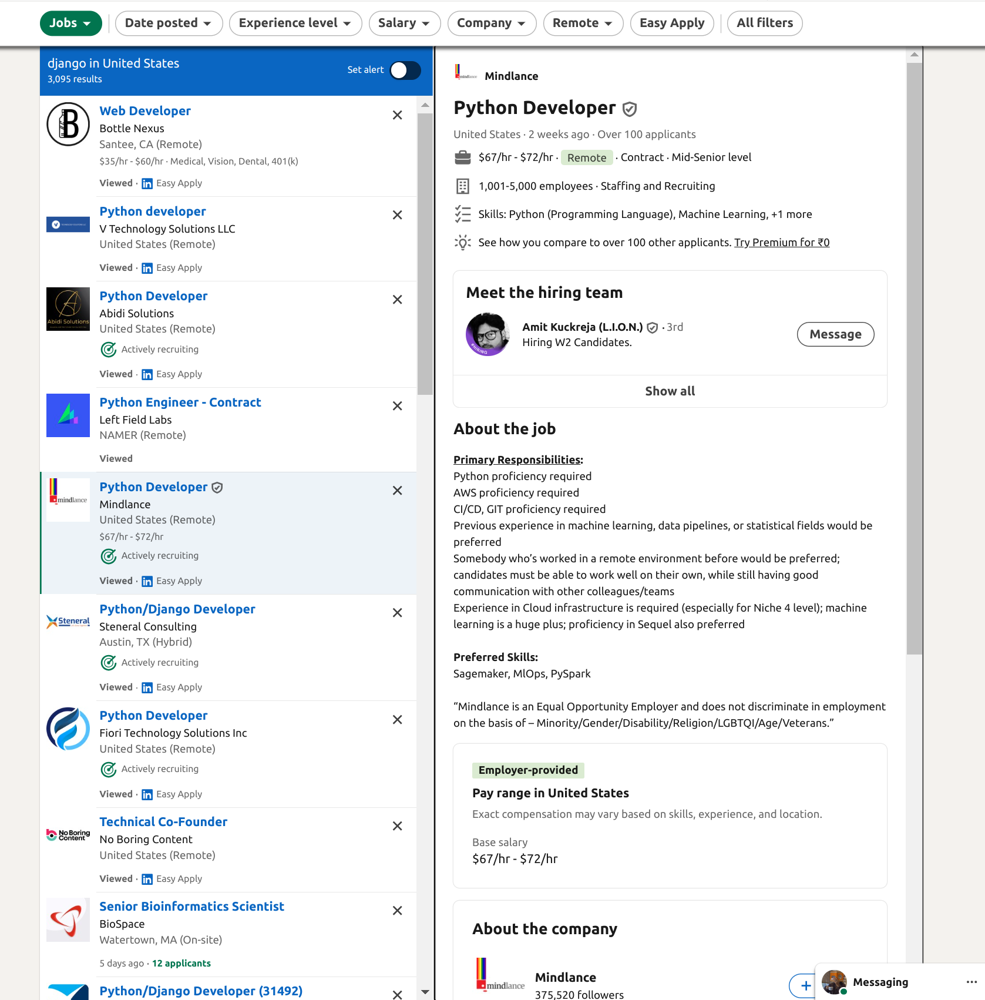

# Job Description Scraper Chrome Extension


## Overview

The Job Description Scraper is a Chrome Extension designed to scrape job details from LinkedIn job postings and store them locally for easy access and review. The extension provides a simple and intuitive interface for users to scrape and view job descriptions, including company name and job title.

## Features

- **Scrape Job Descriptions:** Easily scrape job details, including company name, job title, and job description from LinkedIn.
- **Local Storage:** Store scraped job details locally using Chrome's storage API.
- **Formatted Display:** Display job details in a clean and readable format.
- **Responsive Button:** Visual feedback for users when the scrape button is pressed successfully.

## Installation

1. **Clone the Repository:**
```bash
   git clone https://github.com/buddhiraz/Chrome-Extension-JobDescription-Scrapper.git
   cd Chrome-Extension-JobDescription-Scrapper
```


# Sample Work Examples :

The original job post is here -->




And the Extension save it as -->


